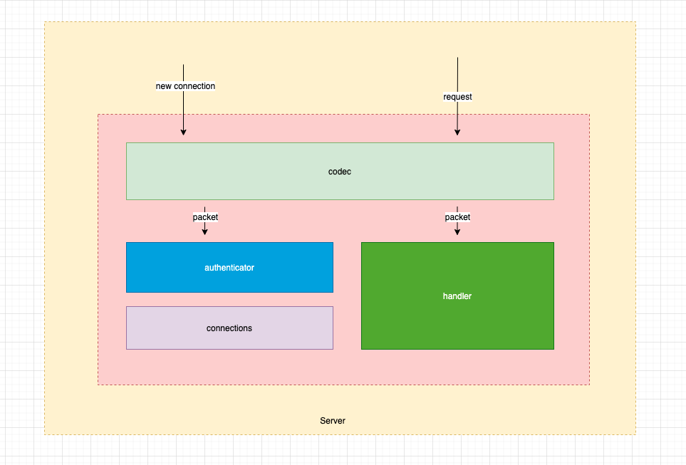

# Sockit (Socket kit)

该库是对socket连接各项功能的一个封装，使用方式类似http标准库。包含以下功能：
1. 自定义封包、解包
2. 自定义鉴权
3. 连接管理
4. 其他


## 整体架构




整体架构比较清晰，主要包括以下模块：
- Server
- ConnManager
- Codec
- Authenticator
- Handler

以上全部为接口类型，在使用中均可以自定义或者扩展已有功能。


### Server

Server主要负责监听端口，接收连接，然后调用ConnManager的StoreConn方法，将连接进行保存管理。
### ConnManager
ConnManager是整个proxy的核心，负责管理连接系统。但是其定义却比较简单：
```go
type ConnManager interface {
	StoreConn(c Conn)
	RemoveSession(id int64) error
	Handler() Handler
	Close() error
}
```

主要就是StoreConn和RemoveSession两个方法，分别用于存储接收到的连接以及移除某个Session（Conn和Session的区别：未经鉴权的为Conn，经过鉴权，确认了身份的为Session）。

proxy提供了默认的ConnManager，具有管理连接、维持心跳等功能，可以直接使用。

```go
type Manager struct {
	mu    *sync.RWMutex
	conns map[int64]*Session

	Authenticator Authenticator
	handler       Handler

	keepaliveTick   time.Duration
	keepaliveTicker *time.Ticker

	closed    chan struct{}
	closeDone chan struct{}
}
```

### Codec
Codec主要用来实现编解码，其类型为一个接口：
```go

type Codec interface {
	Read(reader io.Reader) (p Packet, err error)
	Write(writer io.Writer, p Packet) error
}

```
Read方法从连接中读取数据并封装为一个Packet，Write方法将一个Packet序列化为字节流，然后写入连接中。
Packet同样也是一个接口：
```go
type Packet interface {
	// Id 获取包的id
	Id() int32

	// Time 获取包发送的时间
	Time() time.Time
}
```
具体Packet类型由用户自己实现，解码得到的Packet会原样传给后续的处理流程，在后续的处理流程中进行类型的判断或者断言。

### Authenticator

Authenticator主要用于权限校验及用户认证，其类型申明如下：

```go
type Authenticator interface {
	Auth(c Conn) (User, error)
}

type User interface {
	Valid() bool
	Id() string
}

```
Authenticator接受一个连接，可以从中读取Packet进行判断，也可以获取对端的ip地址等进行判断，如果鉴权失败
可以返回一个error，由上端来关闭连接。
鉴权成功后，需要返回一个User用户信息，上端通过Valid方法来判断鉴权是否成功，是否是个合法用户，
通过Id方法可以来获取用户标识。


### Handler

Handler是处理各种逻辑的主要入口。Handler定义如下：
```go
type Handler interface {
	Handle(packet Packet, s *Session)
}
```
Handler首先接受一个Packet参数，Packet为经过Codec.Read返回的参数，同时还接受一个*Session类型的参数
，该参数标识当前的会话，用户可在当前会话中保存一些自定义的数据。

```go

func (h Handler)Handle(p Packet, s *Session) {
	s.Set("name", p.(NamePacket).Name)
	s.Set("isLogin", true)
}

```
同时，也可以给通过*Session来给对端发送Packet等。这一块的逻辑实际上有点类型于标准库的http的
Handler的逻辑，接收一个*http.Request，然后通过ResponseWriter返回数据。

Handle方法主要是用于处理客户端主动发送过来的数据包，如果想要主动给客户端发送消息，可在Handler中保存Manager，然后获取或者遍历所有的Session进行发送
数据。例如：


```go

type handler struct {
    mgr *Manager
}

func (h *handler) Handle(p Packet, s *Session) {
    cid := p.(NotifyPacket).ClientId

    // notify all sessions
    h.mgr.RangeSession(func(sess *Session) {
    	if s.Id()!=sess.Id(){
            pkt := &msgPkt{}
            pkt.cid = cid
            // .....
            sess.SendPacket(pkt)
        }
    })
}


```

以上所有模块均可自己实现，也可以通过嵌套的方式扩展现有模块的功能。
